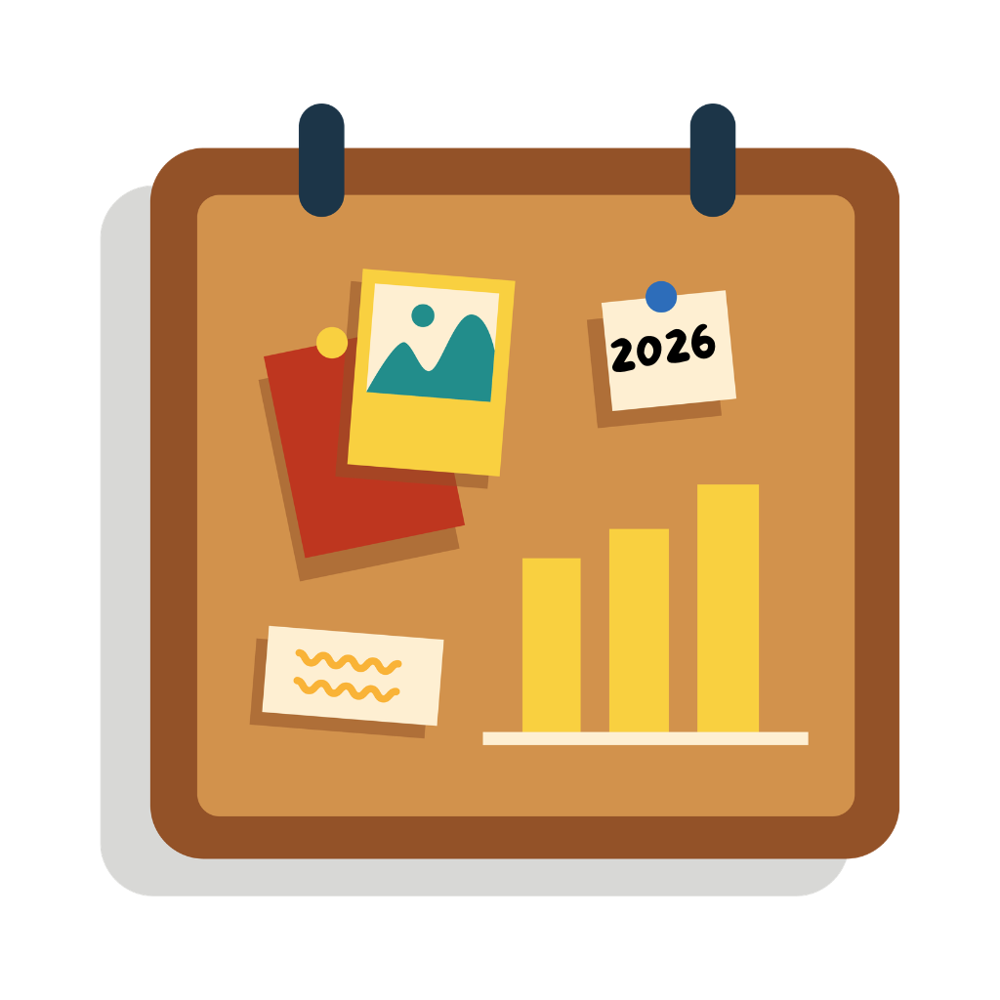
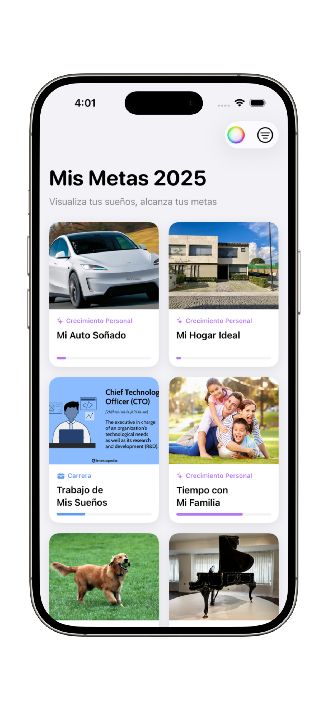
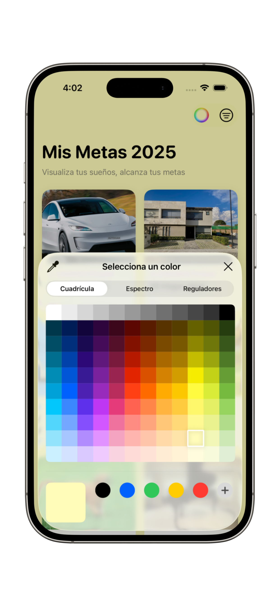
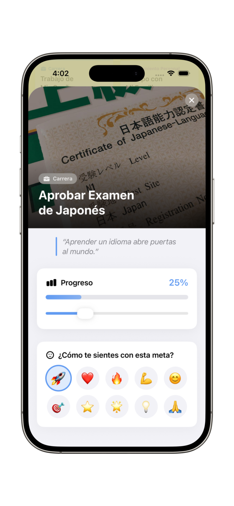
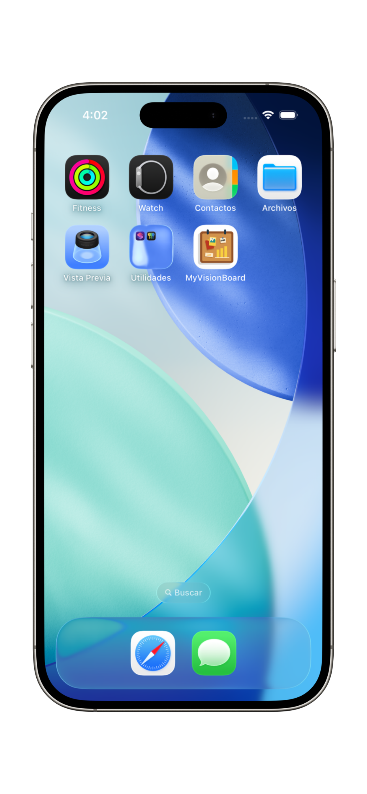

# MyVisionBoard 🚀

  

## 📌 Overview

**MyVisionBoard** is a natively crafted iOS application built entirely with **SwiftUI**. It serves as a digital vision board, allowing users to seamlessly visualize, organize, and track their personal goals and aspirations.

Designed with a strict adherence to Apple's Human Interface Guidelines (HIG), the app features a clean, minimalist aesthetic, prioritizing usability, accessibility, and an immersive user experience.

---

## 📺 Demo Video

Check out the full walkthrough of the application, where I explain the features, the codebase architecture, and the SwiftUI concepts implemented:

  

---

## 💻 Tech Stack

  
  
  
  

---

## 🎨 User Interface & Experience

  <table>
    <tr>
      <td align="center"></td>
      <td align="center"></td>
      <td align="center"></td>
      <td align="center"></td>
    </tr>
  </table>

---

## 🛠️ Technical Highlights

As a software engineer, I focused on building a robust and scalable architecture using modern iOS development paradigms:

* **SwiftUI Framework:** Entirely developed using declarative UI paradigms. Leveraged `LazyVGrid`, `NavigationStack`, `ScrollView`, and custom `ZStack` compositions for responsive layouts.
* **State Management:** Utilized SwiftUI's native property wrappers (`@State`, `@Binding`, `@Environment`) for seamless data flow and predictable UI updates.
* **Modern UI Patterns:**
    * **Edge-to-Edge Design:** Implemented immersive, full-bleed imagery on detail views.
    * **Inline Editing:** Replaced cumbersome modals with intuitive, inline text editing for the board's title.
    * **Fluid Animations:** Integrated `.spring()` and `.easeOut()` animations to provide delightful, tactile feedback during user interactions (e.g., progress bar filling, feeling selection).
* **Accessibility (A11y):** Integrated VoiceOver support (`.accessibilityLabel`, `.accessibilityHint`, `.accessibilityAddTraits`) ensuring the application is usable by everyone.
* **Apple HIG Compliance:** Maintained a clean visual hierarchy using system colors (`.systemGroupedBackground`, `.secondarySystemGroupedBackground`), native typography, and standard corner radii (`.continuous`).

---

## 🚀 Features

* **Visual Grid Layout:** View all goals at a glance with beautiful image cards and progress indicators.
* **Category Filtering:** Filter aspirations by categories (Health, Career, Personal Growth) via a native navigation toolbar menu.
* **Customization:** Personalize the board's background color and title.
* **Interactive Goal Tracking:** Track progress interactively with sliders and record emotional states with a custom emoji picker.
* **Dark Mode Support:** Fully responsive to system appearance changes using dynamic iOS system colors.

---

## 👨‍💻 Author

**Christian Arzaluz**
iOS Developer passionate about creating beautiful, user-centric applications.